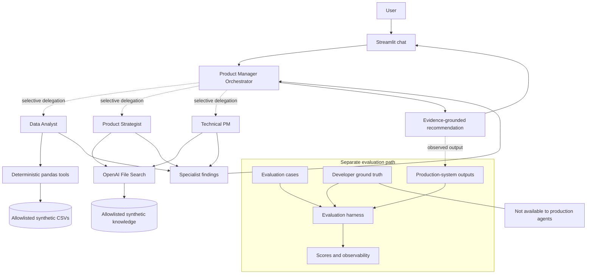

# AI Product Manager Workbench

An agentic product-decision workbench for **CallGuard AI**, a fictional B2B call
reputation platform. It selectively combines specialist agents, auditable pandas
analytics, retrieved company context, and evaluation-backed PM recommendations.

> **Demo environment:** every company, customer, product, and usage record is synthetic.

## What It Does

Give the Streamlit app an ambiguous product question. A Product Manager Orchestrator
decides whether it needs quantitative, strategic, or technical support, consults only
the relevant specialists, and synthesizes an evidence-grounded recommendation. The UI
then discloses the agents, analytical tools, knowledge files, latency, and token usage
involved—without exposing private reasoning or prompts.

## Why I Built It

The project explores a practical product question: how can an AI system support PM
judgment while remaining measurable and inspectable? It demonstrates selective
multi-agent orchestration, deterministic analysis, RAG, evidence/assumption
separation, evaluation-driven iteration, and responsible demo design.

## Demo Scenarios

- **Quantitative diagnosis:** “What happened to EU latency?”
- **Product knowledge:** “Who are CallGuard's main personas and what matters most to them?”
- **Featured full-system decision:** “Should we roll back v3.2 specifically for Tier 1
  carriers? Consider model performance, customer strategy, and technical mitigation options.”
- **Product prioritization:** “Should CallGuard prioritize fixing v3.2 or investing
  further in explainability?”

See [the demo guide](docs/demo_guide.md) for an interview-ready walkthrough.

## Architecture



The production path is `app.py` → orchestrator → specialist tools. Evaluation is a
separate consumer of production outputs; `data/ground_truth.md` is accessible only
through evaluation code and is never indexed or sent to production agents.

## Agent Responsibilities

- **Product Manager Orchestrator:** understands intent, delegates minimally, and owns
  the final PM recommendation.
- **Data Analyst:** uses 13 read-only analytical tools for model quality, complaints,
  customer risk, reliability, usage, and experiments.
- **Product Strategist:** retrieves personas, strategy, roadmap, and market context.
- **Technical PM:** retrieves architecture context and assesses rollout, reliability,
  feasibility, and engineering tradeoffs.

Specialists are exposed as tools rather than handoffs, keeping the orchestrator in
control of the conversation and final synthesis.

## Deterministic Analytics vs RAG

Deterministic tools calculate reproducible metrics from allowlisted synthetic CSVs;
their results include filters, definitions, time periods, and sample sizes. RAG uses
OpenAI File Search to retrieve qualitative context from five allowlisted Markdown
documents. Raw CSVs are not placed in the vector store, and the LLM is not asked to
perform arithmetic that pandas can calculate consistently.

## Evaluation & Observability

The checked-in 12-case suite measures necessary and unnecessary routing, analytical
and knowledge evidence, conclusion requirements, uncertainty, latency, specialist
calls, tool failures, and actual SDK token usage. A separate optional model judge can
assess qualitative synthesis; its opinion is not treated as objective ground truth.

The Streamlit transparency expanders show public execution facts only: agents
involved, tools called, knowledge filenames, latency, and available token counts.
They do not show chain-of-thought, hidden prompts, secrets, or private traces.

## Evaluation Results

Two unchanged Phase 6.2 stability runs over the synthetic suite produced:

| Metric | Observed result |
|---|---:|
| Routing coverage | 100% in both runs |
| Routing precision | approximately 95.8% |
| Evidence coverage | approximately 95.8%–100% |
| Average latency | approximately 15.6–16.0 seconds |
| Analytical tool failures | 0 |

Qualitative synthesis and individual case outcomes still varied between runs. These
are portfolio-test results on synthetic scenarios, not a claim of production-grade
reliability; model and service behavior may change future results.

## Responsible AI / Security

- All data and knowledge are synthetic, with explicit labels in the UI and docs.
- `.env` and `.streamlit/secrets.toml` are ignored; keys are never printed or shown.
- Production tools and RAG use explicit file allowlists. Ground truth is evaluation-only.
- Prompts, retained history, and per-session requests are bounded for a public demo.
- There is no file upload, arbitrary code execution, local file browser, authentication,
  durable user storage, or access to real customer systems.
- Recommendations remain advisory and require human validation.

Default demo limits are 2,000 characters, 12 retained messages, and 8 requests per
session. Configure them with `CALLGUARD_MAX_PROMPT_CHARS`,
`CALLGUARD_MAX_HISTORY_MESSAGES`, and `CALLGUARD_MAX_REQUESTS_PER_SESSION`; invalid
or excessive values fall back to safe defaults.

## Tech Stack

- Python 3.13
- OpenAI Agents SDK and OpenAI File Search
- pandas
- Streamlit
- python-dotenv
- Python `unittest`

## Run Locally

From the repository root:

```powershell
py -3.13 -m venv .venv
.venv\Scripts\Activate.ps1
python -m pip install -r requirements.txt
Copy-Item .env.example .env
```

Add your key only to the ignored `.env` file:

```text
OPENAI_API_KEY=
```

Create or reuse the allowlisted knowledge index, then run the app:

```powershell
python scripts/setup_knowledge_base.py
streamlit run app.py
```

The indexing script uploads only `company_overview.md`, `personas.md`,
`product_strategy.md`, `architecture.md`, and `roadmap.md`. It persists safe IDs and
hashes in `config/vector_store.json`. Hosted environments may instead set
`CALLGUARD_VECTOR_STORE_ID`.

Run deterministic tests with:

```powershell
python -m unittest discover -s tests -v
```

## Deployment

For Streamlit Community Cloud, fork the repository, select `app.py` as the entry
point, and use Python 3.13 from `.python-version`. In the app's **Secrets** settings,
add:

```toml
OPENAI_API_KEY = "your-key-here"
```

Also supply `CALLGUARD_VECTOR_STORE_ID` as an environment variable or retain the safe
checked-in vector-store configuration. Review the demo limits and OpenAI account
budget before sharing the URL. `requirements.txt` contains the complete runtime
dependencies; repository paths are resolved relative to the project root and have no
Windows-only runtime assumptions. This repository does not deploy automatically.

## Known Limitations

- Model routing and qualitative synthesis are nondeterministic.
- Complex requests commonly take 15–20 seconds and consume several model calls.
- Evaluation checks are synthetic and some evidence matching is wording-based.
- Nested hosted-retrieval observability is less detailed than local tool telemetry.
- The demo has session limits, not identity-based quotas, authentication, or durable storage.
- It has no production data, live integrations, monitoring, or approval workflow.

## Project Evolution

1. Single PM agent and Streamlit chat
2. Fictional CallGuard company and deterministic synthetic data
3. Auditable analytical tools
4. Allowlisted RAG knowledge base
5. Selective multi-agent orchestration
6. Evaluation, observability, routing refinement, and stability measurement
7. Portfolio UX, public-demo safeguards, deployment readiness, and interview documentation

For implementation decisions and interview talking points, see
[docs/interview_talking_points.md](docs/interview_talking_points.md).
